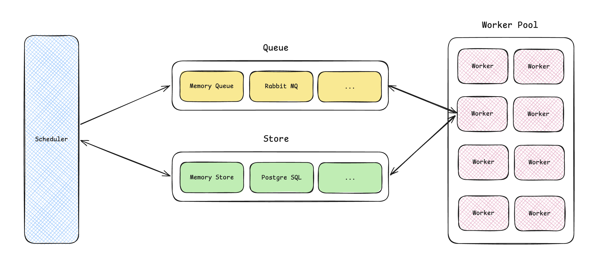

# 🐺 Wagon

> *"A wise wolf never misses a task — and a sturdy wagon never loses its cargo."*

**wagon** is a task scheduling library of go, and it will support more features and reliable things in the future.


## Requirements

- Go **1.25** or higher


## **Architecture**




## Installation

```shell
go get -u github.com/salmonfishycooked/wagon
```


## Quick Start

following example shows how to use the basic schedule functionality. (schedule at expected time)

same as [example/basic_schedule.go](./example/basic_schedule.go).

```go
package main

import (
	"context"
	"fmt"
	"log/slog"
	"os"
	"time"

	"github.com/salmonfishycooked/wagon"
	"github.com/salmonfishycooked/wagon/queue"
	"github.com/salmonfishycooked/wagon/scheduler"
	"github.com/salmonfishycooked/wagon/store"
	"github.com/salmonfishycooked/wagon/task"
	"github.com/salmonfishycooked/wagon/worker"
	"github.com/salmonfishycooked/wagon/worker/pool"
)

var handler = func(ctx context.Context, tsk *task.Task) (result []byte, err error) {
	return []byte(tsk.Name), nil
}

func main() {
	ctx, cancel := context.WithCancel(context.Background())
	defer cancel()

	logger := slog.New(slog.NewTextHandler(os.Stdout, &slog.HandlerOptions{
		Level: slog.LevelInfo,
	}))

	// use default queue and store
	q, _ := queue.NewDefaultConnector().Connect(ctx)
	s, _ := store.NewDefaultConnector().Connect(ctx)

	// use default scheduler, worker pool and engine
	sched, _ := scheduler.NewDefaultScheduler(q, s, scheduler.WithLogger(logger))

	workerPool, _ := pool.NewDefaultPool(func() (worker.Worker, error) {
		return worker.NewWorker(handler, q, s, worker.WithLogger(logger))
	}, pool.WithLogger(logger))

	engine, _ := wagon.New(sched, workerPool)

	// start scheduling engine
	_ = engine.Start(ctx)

	// submit two example tasks
	id1 := "my-task-id1"
	task1 := &task.Task{
		ID:         id1,
		Name:       "🃏task 1, delay in 3s",
		ScheduleAt: time.Now().Add(time.Second * 3),
		Payload:    nil,
	}
	_ = engine.Submit(ctx, task1)

	id2 := "my-task-id2"
	task2 := &task.Task{
		ID:         id2,
		Name:       "🃏task 2, delay in 5s",
		ScheduleAt: time.Now().Add(time.Second * 5),
		Payload:    nil,
	}
	_ = engine.Submit(ctx, task2)

	time.Sleep(time.Second * 6)

	// query the final result of tasks
	fmt.Println("-----------------------------------------------------------------------------------")
	tsk1, _ := s.Get(ctx, id1)
	fmt.Println("🎉 task1 information:", tsk1)
	tsk2, _ := s.Get(ctx, id2)
	fmt.Println("🎉 task2 information", tsk2)
	fmt.Println("-----------------------------------------------------------------------------------")

	// shutdown the engine
	_ = engine.Shutdown(ctx)
}
```

for more examples, see [example](./example).


## Contributing

Contributions are warmly welcome! Whether it's a bug report, a feature request, or a pull request — every contribution helps the wagon roll further.


## License

Wagon is open-source software licensed under the [MIT License](./LICENSE).


<p style="text-align: center;">
  <em>In memory of the trading roads between Pasloe and the great markets of the north.</em><br>
  <em>May your tasks always reach their destination. 🐺🌾</em>
</p>