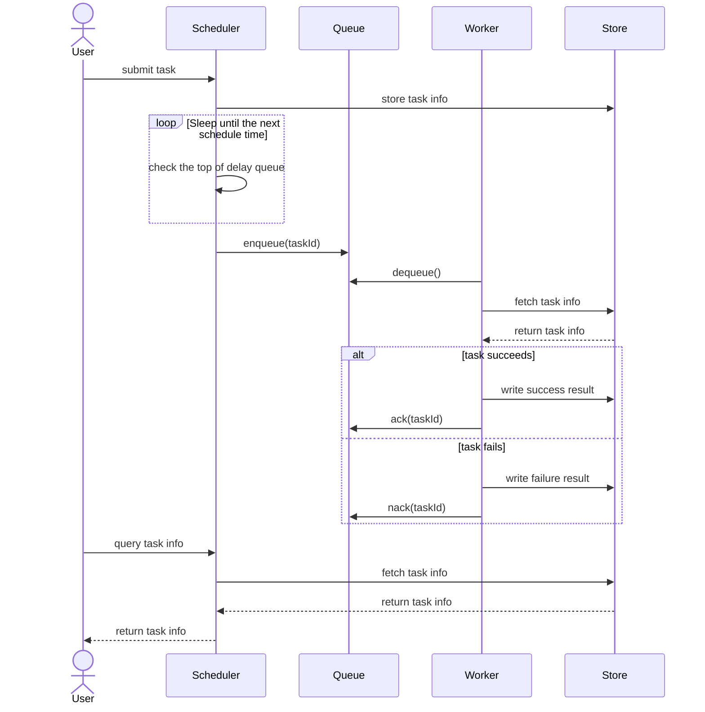
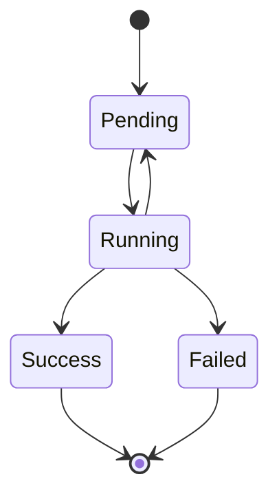
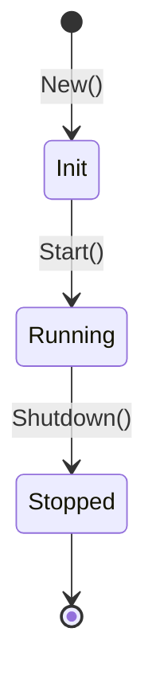

## **Overview**

This is a task scheduling library of Golang.

## **Requirements**

User submits a task to scheduler with a exact schedule time (schedule time means when will user's task be submitted into task queue), and once the task is submitted into the queue, one of workers will acquire it from the task queue, and execute it and store the final result into database.

## **Architecture**

## **How does wagon execute a task?**

## Module

### Task

#### State Transition

For now, we've designed four states for task:

- Pending
- Running
- Success
- Failed

The state transition graph is as follows:

### Scheduler

#### State Transition

- Init
- Running
- Stopped

### Worker Pool

#### State Transition

- Init
- Running
- Stopped

### Worker

#### State Transition

- Init
- Running
- Stopped

### Engine

#### State Transition

- Init
- Running
- Stopped

