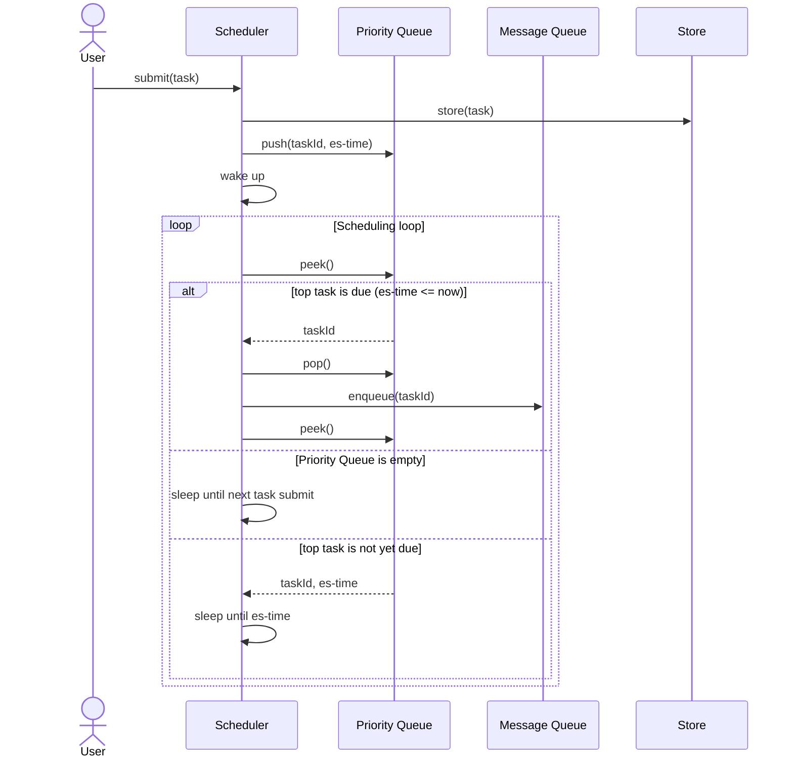

## How is a task pushed into queue at expected schedule time?

> We will call "expected schedule time" as "es-time" in this part.

> [!IMPORTANT]
>
> We used Priority Queue to optimize time perplexity.

**Entire Process**:

User submits a task.

Scheduler then:

1. Save the task information to Store.
2. push the task into Priority Queue. (whether current time is or not after es-time)
3. Wake up the scheduler, then check the Priority Queue whether there is any task that have already been due.
4. If any, enqueue them, then calculate next sleeping time based on the top of the Priority Queue. If the Priority Queue is empty, the scheduler should sleep eternally (it will wake up when next task is submitted).

Below is the corresponding Sequence Diagram.

